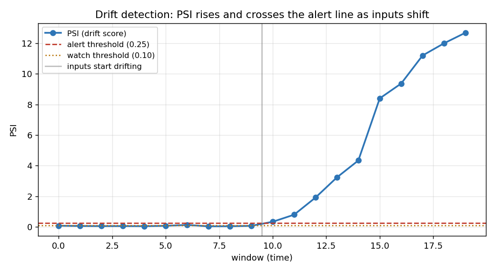

# ML Model Serving & Monitoring Service

A production-grade serving layer for a trained ML model, in Python. It takes a
model and **operates it**: a validated prediction API, request batching for
throughput, latency/output monitoring, and **drift detection** that alarms when
live inputs stop looking like the training data.

This is the MLOps half of ML engineering — the 90% of the work that isn't
training the model. Built in five phases, each independently runnable and tested.



*The headline: a model silently degrades when inputs shift. This service detects
that — PSI (a drift score) hugs zero while inputs are stable, then crosses the
alert line the moment they drift.*

## What it does

- **Prediction API** — `POST /predict` returns a label + confidence.
- **Validation & abstain** — rejects bad input; returns "low confidence / abstain"
  instead of a shaky guess when the model isn't sure.
- **Batching** — collects near-simultaneous requests and runs the model once on
  the batch, amortizing the fixed per-call cost (measured ~12x throughput).
- **Monitoring** — throughput, p50/p95/p99 latency, and prediction mix over time.
- **Drift detection** — compares live input distribution to a baseline (PSI) and
  alerts on significant drift.

## The model is pluggable

The model sits behind a small interface, so the entire serving stack is built
and tested with a dependency-free stub, then swaps to a real model with one
line:

- **StubTextClassifier** (dep-free, deterministic) → **TransformerClassifier**
  (your fine-tuned DistilBERT) on Colab.

The serving, batching, metrics, and drift logic are **model-agnostic** — which
is exactly why they're the contribution. This kept the project buildable
without a GPU, and the infrastructure is what an ML-serving role is about.

## Phases

| Phase | Adds | Key idea |
|-------|------|----------|
| **1** | prediction API | model loaded once, behind a pluggable interface |
| **2** | validation & abstain | reject bad input; refuse when unsure |
| **3** | batching | amortize per-call cost — measured ~12x throughput |
| **4** | metrics | throughput, p95/p99 latency, prediction mix |
| **5** | drift detection | PSI baseline comparison with alerting |

Each phase has its own README (README_serve_phase1.md ... README_serve_phase5.md) with the details.

## Quick start

```bash
pip install -r requirements.txt

# run the prediction service (Phase 2 has validation + abstain)
uvicorn serve_phase2:app --port 8000

curl -X POST localhost:8000/predict -H 'content-type: application/json' \
  -d '{"text":"SHOCKING secret cure they do not want you to see!!!"}'
# {"label":"fake","confidence":0.9998,"abstained":false,...}

curl -X POST localhost:8000/predict -H 'content-type: application/json' \
  -d '{"text":"the quarterly report is attached"}'
# {"label":"low_confidence","predicted_label":"real","abstained":true,...}
```

## Headline numbers

**Batching throughput (Phase 3):**
```
200 requests, model call-cost 20ms + 1ms/item
  unbatched: 4.23s  (  47 req/s)
  batched:   0.35s  ( 565 req/s)   ->  11.9x speedup
```

**Drift detection (Phase 5):** stable windows score PSI ~0.05–0.13 (no alert);
the moment inputs drift, PSI crosses the 0.25 alert threshold (see chart above).

## Tests

Every phase ships tests.

```bash
python test_serve_phase1.py   # prediction API
python test_serve_phase2.py   # validation & abstain
python test_serve_phase3.py   # batching (correctness under concurrency)
python test_serve_phase4.py   # metrics (incl. exact percentile math)
python test_serve_phase5.py   # drift detection (sensitive AND specific)
```

Highlights: batching is tested for correct result-routing across concurrent
callers; the drift detector is tested to both catch real drift and ignore noise.

## Tech stack

- Python
- `FastAPI` + `uvicorn` — the prediction API (reused across projects)
- your trained model (DistilBERT / EfficientNet) behind a pluggable interface
- `asyncio` — the batching worker
- `matplotlib` — the monitoring and drift charts
- standard library stats for PSI (no heavy deps)

## A note on origins

This gives a production home to models trained earlier — a DistilBERT fake-news
detector and an EfficientNet document-authenticity checker. It reuses the
FastAPI skeleton from a [rate limiter
service](https://github.com/NitishaB4042/rate-limiter-service) and the
metrics/dashboard approach from a [distributed web
crawler](https://github.com/NitishaB4042/distributed-web-crawler).

