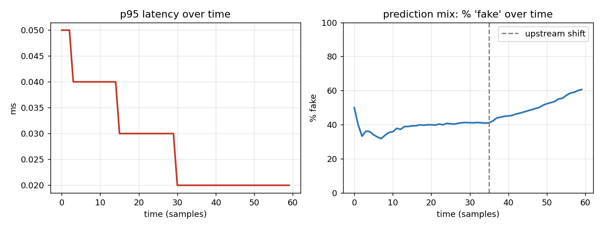

# ML Model Serving & Monitoring — Phase 4

Metrics & monitoring. You can't operate what you can't see — so every prediction
is recorded and summarized into throughput, latency percentiles, and the
prediction mix over time.

## Files
- `metrics_phase4.py` — the `Metrics` collector + `MonitoredModel` wrapper + demo
- `test_serve_phase4.py` — tests (incl. exact percentile-math checks)
- `serving_metrics.png` — example monitoring snapshot



## What it tracks
- **Throughput** — requests per second over a rolling window.
- **Latency percentiles** — p50 / p95 / p99, not just the average.
- **Prediction mix** — the distribution of outputs (e.g. % 'real' vs 'fake')
  over time. A sudden shift is an early warning that something changed upstream
  (and a natural lead-in to drift detection in Phase 5 — see the right panel).

## Why percentiles, not the average
The average hides the tail. If 1% of requests take 50x longer, the mean barely
moves — but those slow requests are exactly what users feel and what SLAs are
written against ("99% of requests under 200ms"). p95/p99 expose the tail you
actually have to manage. This is one of the most common things ML-serving
interviews probe.

```
  total requests : 300
  throughput     : 414 req/s
  latency (ms)   : p50=0.02  p95=0.03  p99=0.09  max=0.12
  prediction mix : {'fake': 148, 'real': 152}
```
Note how p99 sits well above p50 — the tail the average would hide.

## How it works
- `Metrics` keeps a thread-safe rolling window of the last N requests
  (latency, label, timestamp). `snapshot()` computes throughput, the
  percentiles, and the prediction mix on demand.
- `MonitoredModel` wraps a predict function, timing each call and recording it —
  so adding monitoring to the service is a one-line wrap.
- Percentiles use the nearest-rank method on the sorted window.

## Run
```bash
pip install matplotlib
python metrics_phase4.py        # feeds mixed traffic, prints a snapshot
python test_serve_phase4.py     # tests
python make_metrics_chart.py    # regenerates serving_metrics.png
```

## Tests cover
- **percentile math against known values** (1..100 → p50=50, p95=95, p99=99)
- empty input → 0; percentiles come out ordered (p50 ≤ p95 ≤ p99 ≤ max)
- prediction-mix counts are correct
- the rolling window drops old data while the total keeps counting everything
- throughput is positive under load
- the `MonitoredModel` wrapper records each call

## Interview notes
- **Tail latency over averages** — always report p95/p99.
- **Prediction mix is a free early-warning signal** — if the % 'fake' suddenly
  jumps, either the input stream changed or the model is misbehaving; either way
  you want to know. Phase 5 turns this instinct into a real drift detector.
- **Rolling window, not all-time** — monitoring should reflect *recent*
  behaviour, so old data ages out.

## Still deferred
- Drift detection + chart → **Phase 5** (the finale)
